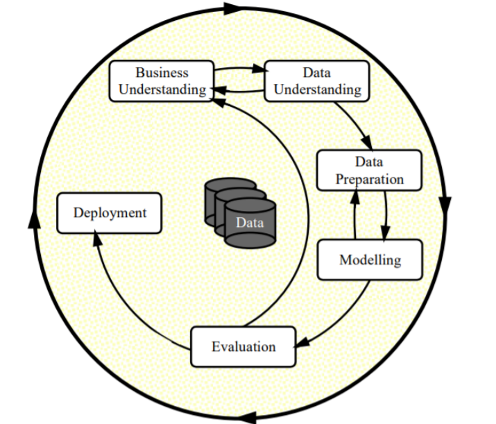
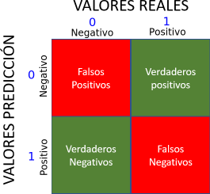
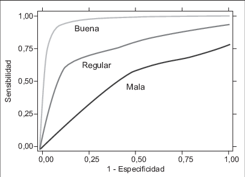
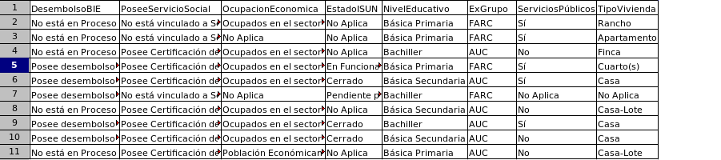
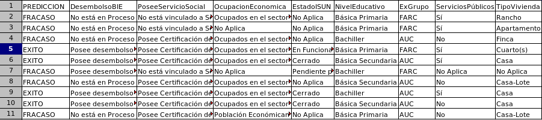

# Instalación
Dos posible instalaciones, la primera si se va a ejecutar desde google COLAB y la segunda solo si se va a ejecutar desde Rstudio instalado localmente en el PC.

## Instalación ambiente google COLAB (en la nube)
Correr esta celda solo si se va a ejecutar desde el ambiente google COLAB, sino saltar a la siguiente.
```{r}
system ("git clone https://github.com/luisgarreta/rlibs.git")
.libPaths("/content/rlibs")
remove.packages ("desistimiento")
devtools::install_github("luisgarreta/alex", upgrade=FALSE)
```

## Instalación ambiente Rstudio (instalado en el PC)
Correr esta celda si se va a ejecutar desde el ambiente Rstudio instalado localmente en el PC.

```{r install}
install.packages("devtools")
remove.packages ("desistimiento")
devtools::install_github("luisgarreta/alex", upgrade=FALSE)
```

# Introducción

El objetivo de este análisis predictivo es crear un modelo que permita predecir si un nuevo desmovilizado que ingresa a un proceso de desmovilización podría culminarlo de forma Exitosa, o por el contrario puede fracasar y abandonar el proceso. Para crear este modelo se toman los datos existentes de desmovilizados que han ingresado al proceso y de los cuales se conoce la situación final del desmovilizado, entre estas situaciones las de éxito o Fracaso. Los datos de desmovilizados se han tomado de los sitios públicos en internet donde el gobierno de Colombia publica este tipo de datos [REFERENCIA].

# Metodología

La metodología que seguimos para el proceso de analítica de datos, CRISP-DM [Wirth2000] se presenta en la siguiente gráfica, y a continuación se describe brevemente:

{width="300"}

## Etapas

1.  **Comprensión del negocio**: se refiere a entender el problema, los objetivos del proyecto en cuanto a la analítica de datos, que se está tratando.

2.  **Comprensión de los datos:** se refiere a entender los datos, su estructura, sus tipos, las limitantes y posibles soluciones.

3.  **Preparación de datos**: Esta es la etapa más importante del proceso e involucra varias actividades, entre las principales:

    1.  Primero, se necesita "formatear" los datos para que se puedan procesar en una herramienta de software, en nuestro caso seleccionamos el ambiente de programación R para realizar todo el procesamiento, análisis, modelamiento, y pruebas.

    2.  Segundo, se necesita hacer una selección de variables o características (Feature selection), es decir, tomar diferentes medidas a las características (columnas) y ver que tan buenas o que tanto aportan (ej. ver si algunas características no aportan nada o dicen lo mismo que otra osea están correlacionadas, etc.) .

    3.  Tercero, una vez se tengan las observaciones y las características, se necesita un proceso de limpieza de los datos, lo cual involucra varioss procedimientos, desde buscar datos faltantes o erróneos y decidir si se elimina la fila o toda la columna, o mejor se imputan (predicen) los faltantes de acuerdo a los datos de la muestra.

    4.  Cuarto, con los datos ya limpios se necesita transformarlos ya sea a datos numéricos o a categorías o una combinación, para que los pueda aceptar el modelo o modelos de predicción que se elijan.

4.  **Modelamiento**: En esta fase se selecciona un modelo conocido de predicción y se buscan los mejores parámetros que permitan que el modelo prediga con mayor exactitud si un nuevo desmovilizado tendría éxtio o Fracaso en el proceso de desmovilización que inicia. Este proceso toma un subconjurnto del total de datos de desmovilizados y a través de cada una de las observaciones busca ajustar sus parámetros hasta alcanzar los valores que le permiten realizar predicciones de gran exactitud.

5.  **Evaluación:** Aquí se busca evaluar la calidad del modelo. El modelo se avalúa con un subconjunto de datos del total de desmovilizados, para los cuales se conoce si tuvieron éxtio o Fracaso en el proceso de desmovilización. Se hacen las predicciones, se comparan con los datos reales, y se calculan unas métricas relacionadas con la exactitud de las predicciones.

6.  **Despliegue:** Esta etapa se refiere a donde va a quedar el modelo elaborado en las etapas anteriores y como se va a utilizar. En nuestro caso, el modelo va a corresponder a una herramienta de software que específicamente va a ser un paquete del lenguaje R que cualquier persona interesada podrá descargar, instalar, y usar para hacer predicciones con datos de nuevos desmovilizados.

## Paquete de funciones en R

Para soportar la metodología anterior y que lo hallazgos de este análisis predictivo se puedan volver a obtener, es decir que el análisis sea reproducilble, hemos construido un paquete de funciones de R llamado "desistimiento" el cual contiene: todos los datos de las estadísticas de los desmovilizados que se utilizan para la creación del modelo predictivo; todas las funciones necesarias para la preparación de esos datos; todas las funciones para el análisis de los datos; todas las funciones para la creación y evaluación del modelo; y las funciones para utilizar el modelo para predecir la situación final de nuevos desmovilizados.

El paquete se llama desde el ambiente de R así:

```{r carga_libreria}
library (desistimiento)
```

# Comprensión del Negocio

El objetivo de este análisis predictivo es crear un model que permita predecir si un nuevo individuo que ingresa al proceso de desmovilización podría culminarlo con éxito o podría fracasar, todo esto dependiendo de una serie de características que presenta cada desmovilizado de forma particular.

# Comprensión de los Datos

Como datos de entrada se tiene una tabla con la información de 55675 desmovilizados correspondiente a 36 características. Es decir, una tabla de datos de 55675 filas por 36 columnas. Cada fila corresponde a un desmovilizado y vamos a referirnos a esta fila como una observación. Así mismo cada columna corresponde a un atributo o información que se tiene del desmovilizado y vamos a referirnos a esta columna como una variable o característica.

De estas 36 variables, una de ellas corresponde a la variable que se busca predecir o variable dependiente y el resto corresponde a las variables que ayudan a realizar la predicción, o variables independientes. Matemáticamente se puede ver como una ecuación de la forma:

Y = aX1 + bX2 + ...zX35

donde Y es la variable dependiente, X1, X2,..., X35 son las variables independientes, y las letras a...z son los parámetros del modelo. Estos últimos son los que el modelo predictivo que se elija buscaría determinar o por lo menos llegar a un valor muy cercano al real.

De acuerdo al conjunto de datos, las variables y su significado son las siguientes:

- SFinal: Variable dependiente a predecir. Indica la situación actual del desmovilizado dentro del proceso, y puede varios valores, pero para la creación del modelo predictivo, vamos a tomar solo dos: "Exito", que corresponde a éxito en el proceso, y "Fracaso", que corresponde a Fracaso en el proceso.
- TipoDes: 
- ExG: 
- GEtario: 
- Sexo: 
- BTRV: 
- BFA: 
- BFPT: 
- BPDT: 
- NEdu: 
- MáxNFPT: 
- OcuEco: 
- TipoBIE: 
- EISUN: 
- PSS: 
- TipoASS: 
- Pareja: 
- Hijos: 
- Gfam: 
- TipoVivienda: 
- SerPúb: 
- RegSalud: 

# Preparación de los datos.

Esta etapa es la más importante de todo el proceso ya que involucra tomar los datos originales, que pueden tener varios problemas, corregir esos problemas, y dejarlos listos para que a partir de ellos se pueda crear un modelo de predicción confiable.

Entre los problemas que se pueden encontrar en los datos están:

-   **Problemas de digitación**: Estos problemas pueden abarcar tanto carácteres o símbolos incorrectos en los valores de los datos, como también separación confusa o erronea de las columnas o variables. Todo esto genera problemas en la lectura de los datos, ya sea que no se puedan leer, que se lean de forma erronea, o que las herramientas automática que estamos utilizando, en nuestro caso el ambiente de programación R, no sea capaz de determinarlos.

-   **Problemas de formato**: Aquí pueden darse problemas en determinar el tipo correcto de los datos, por ejemplo valores numéricos o fechas pueden tomarse erroneamente como cadenas de texto.

-   **Problemas de datos nulos**: Columnas con datos incompletos, erroneos, o inexistentes.

-   **Variables correlacionadas**: Variables o características que estén midiendo lo mismo o por lo menos están bastante correlacionadas y por lo tanto se podría mantener dentro del análisis solo una de ellas y eliminar las otras.

-   **Nombres largos**: Algunas variables o los estados que tienen esas variables pueden ser textos muy largos. Esto puede dificultar la presentación de resultados debido a la limitación de espacio que tiene una pantalla de computador o una hoja de papel. Por lo tanto se debería, en lo posible, abreviar esos nombres.

-   **Datos no necesarios**: Algunos datos no son de interés para este análisis y por lo tanto se deben eliminar para simplificar el conjunto de datos. Esto sucede con la variable dependiente "SFinal" en la cual solo interesan dos estados: "CULMINADO" y "FUERA". Los demás estados no interesan por ahora ya que el modelo predictivo que vamos a crear es binario y va a predecir uno de estos dos estados.

## Datos finales

La preparación de los datos inicia con el conjunto de datos finales que resultó después de una limpieza, preparación y análisis previo de los datos originales. Al final se obtuvo una versión para leerse en el ambiente R. La función que los obtiene se llama "ds_datos_finales", así:

```{r,rows.print=15}
datos_finales = ds_datos_finales ()
```
La función muestra que el conjunto de datos del que partimos contiene 22 variables y 5874 registros.

## Estructura inicial del conjunto de datos

Antes de iniciar cualquier análisis es importante que conozcamos la estructura de los datos con los que vamos a trabajar, específicamente lo que se refiere a los tipos de datos de cada variable, ya sea categóricos (o cualitativos), númericos (o cuantitativos), fechas, u otro tipo de datos.

El paquete de funciones "desistimiento" ofrece la funcion "ds_mostrar_estructura" que muestra la estructura actual y a la vez la guarda en un archivo llamado "estructura_datos.csv". De esta manera, se puede revisar si la estructura de los datos que está leyendo el ambiente R es la estructura que los datos deben tener, y si no es así entonces se deben hacer los cambios respectivos antes de iniciar otros análisis. La función se utiliza así:

```{r, rows.print=30}
ds_mostrar_estructura ("datos_finales.csv")

```

La tabla muestra por cada variable la siguiente información:

-   Tipo de la variable (ej. CUALITATIVA, CUANTITATIVA, o FECHA).

-   Nombre de la variable (ej. TipoDesmovilización)

-   Valores de la variable, que pueden ser de tres tipos:

    -   CUALITATIVO: Muestra los valores categóricos que puede tomar la variable y los cuales están enumerados desde 1 hasta el N-esimo valor (ej. [1] Colectiva [2] Individual).

    -   CUANTITATIVO: Muestra el rango de valores de la variable con su valor mínimo y su valor máximo.

    -   FECHA: En este caso las fechas deben tener el formato "dd-mm-yyyy". Si las variables no tienen ese formato, entonces el ambiente R tomará erroneamente esas fechas como valores cuantitativos (ej. 2000, 2002, 2003,..).

## Selección y modificación de la variable objetivo
El objetivo del modelo predictivo que vamos a construir es predecir si un desmovilizado tendrá éxito o Fracaso dentro de un proceso de desmovilización dado las características propias del desmovilizado, tales como la edad, número de hijos, nivel de eduación, trabajo actual, entre otras.

La variable objetivo o variable dependiente de nuestro problema es la variable que se quiere predecir tomando como información el resto de variables o variables independientes. Como se mostró anteriormente, matemáticamente se puede ver como una ecuación de la forma:

Y = aX1 + bX2 + ...zX35

donde Y es la variable dependiente, X1, X2,..., X35 son las variables independientes, y las letras a...z son los parámetros del modelo predictivo que se vaya a utilizar para la predicción. Estos parámetros son los que el modelo predictivo buscará determinar o por lo menos llegar a un valor muy cercano al real.

Para nuestro problema la variable objetivo es la que se llama "SFinal" y que es una variable CUALITATIVA que indica la situación actual del desmovilizado dentro del proceso. Esta variable tiene los siguientes valores:

-   "Exito"

-   "Fracaso"

# Limpieza de los Datos

## Limpieza de valores nulos (NAs)

Puede que algunos valores de las variables sean nulos o no existan. Esto es muy común en la toma de datos ya que puede suceder que se digitó mal los datos, o no existe información para ese estado de la variable, o al encuestar al desmovilizado este no respondió a una determinada pregunta, todo lo anterior da como resultado valores nulos o inexistente dentro de las variables que se deben manejar.

Una forma de manejar los valores nulos es eliminar las observaciones que los tienen, siempre y cuando exista un gran número de observaciones. Para nuestro caso, en los últimos datos que se grabaron en el archivo "datos_MODIFICADOS.csv" quedaron exactamente 45883 observaciones, que es un gran número y por lo tanto vamos a remover las observaciones que tengan algún valor nulo.

Para realizar la limpieza anterior hemos creado dentro del paquete "desistimiento" una función que muestra el número de valores nulos por cada variable y realiza la selección de las observaciones que no contengan ningun valor nulo. Los nuevos datos se escriben en un archivo llamado "datos_NoNulos.csv". La función se llama así:

```{r, rows.print=35}
ds_procesar_nulos ("datos_finales.csv")
```

De acuerdo a los resultados anteriores, se observa por cada variable el número de valores nulos antes y despúes de eliminar las observaciones que tienen algún valor nulo, columnas "NroNulosAntes" y "NroNulosDespues", respectivamente. Como se habia mencionado antes, estos datos finales ya fueron procesados anteriormente y como vemos no tienen nulos.

## Análisis Exploratorio de Datos

El análisis exploratorio de datos se refiere al proceso de realizar un análisis inicial con la ayuda de estadísticas resumidas y representaciones gráficas de los datos para descubrir similaridades, tendencias, anomalías, o verificar suposiciones. Este análisis permitirá al final conocer que variables pueden descartarse ya sea porque no aportan información al modelo, o porque repiten información de otras variables, o porque puede volver complejo el análisis.

### Análisis de las Variables Cuntitativas o Númericas

Para las variables numéricas vamos a calcular sus correlaciones entre pares para determinar que variables tienen altas correlaciones y por lo tanto están aportando información muy similar.

Para esto, hemos creado dentro del paquete "desistimiento" la función llamada "ds_analisis_cuantitativas" que muestra las correlaciones entre las variables que sean numéricas y si existe un par de variables con una correlación alta de más del 80% se elimina una de ellas.

```{r}
matrixCorrelaciones = ds_analizar_cuantitativas ("datos_NoNulos.csv")
ver (matrixCorrelaciones)
```

De los resultados anteriores, la matrix de correlaciones muestra que las variables "Hijos" y "Gfam" están muy correlacionadas (80%) y por lo tanto se debería eliminar una de ellas ya que ambas variables brindan la misma información. Esta eliminación se hará más adelante. 

### Análisis de Variables Categóricas

Para analizar lar variables categóricas, vamos a construir gráficos o histogrmas que nos ayuden a ver de forma visual como se están distribuyendo los distintos valores de cada variable.

Para esto hemos creado la función "ds_distribuciones" que crea en un archivo llamado "graficos_distribuciones.png" las distribuciones de cada variable del conjunto de datos de entradas, la función se llama así:

```{r}
ds_distribuciones ("datos_NoNulos.csv");
```

Observando los gráficos anteriores, nos interesa determinar las variables que pueden causar "ruido" al análisis, ya sea por alguna de las siguientes razones:

-   **Distribuciones similares entre variables:** representan variables con la misma información al de otras variables y por lo tanto es suficiente con preservar una sola de ellas.

-   **Distribuciones con un valor dominante:** son variables que presentan un único valor o si presentan más de un valor, la proporción de estos es muy baja frente a un valor dominante, por lo tanto brindan muy poca información y se deben eliminar del análisis.

-   **Distribuciones complejas:** son variables que tienen un gran cantidad de categorias y vuelven el análisis muy lento o imposible para los algoritmos o modelos predictivos que se vayan a utilizar, por tanto se las debe eliminar del análisis.

Teniendo en cuenta las razones anteriores junto con los gráficos de las distribuciones las variables, podemos observar lo siguiente:

-   La variables "TipoDes" presenta de forma clara una distribución con un valor dominante. Por lo tanto esta variable no brinda gran información y como veremos más adelante, se eliminará del análisis.

-   El resto de las variables se les observa una distribución con por lo menos dos estados diferenciados y se dejan para el análisis.

### Eliminación de variables que causan ruido.

De acuerdo a los dos análisis anteriores, tanto de las variables cuantitativas como de las cualitativas, se deben eliminar las variables que puedan causar problemas en los análisis siguientes. Para esto hemos implementado la funcion "ds_eliminar_variables" que elimina de un conjunto de variables de un conjunto de datos y guarda los resultados en un archivo llamado "datos_Filtrados.csv" . La función se llama así:

```{r, rows.print=35}
variables = c("Gfam", "TipoDes")
ds_eliminar_variables ("datos_NoNulos.csv", variables)
```

Como se puede observar en la tabla anterior, se ha pasado de 22 a 20 variables . Estas ultimas variables son las que se tomarán de aquí en adelante para realizar los análisis siguientes.

## Limpieza de categorías con pocas observaciones

En este análisis buscamos las categorías por cada variable que tengan muy pocas observaciones en relación al total del conjunto de datos, las cuales al momento de construir el modelo predictivo van a presentar problemas para el modelo.

Es decir, si una categoría, por ejemplo "Vaupés", que pertenece a la categoría "DptoResidencia" tiene solo 10 observaciones frente a las más de 25000 que existen, entonces esas 10 observaciones que pertenecen a 10 desmovilizados se eliminan del conjunto de datos.

Para hacer este proceso para todas las variables, vamos a definir una proporción de observaciones mínima del 0.05% de todas las observaciones, es decir, de 25928 observaciones que existen, por lo menos deben existir 130 individuos en cada categoría. Si no es así, los individuos de esa categoría que no cumple el mínimo se eliminan.

Para esto hemos construido la función "ds_limpiar_observaciones" que toma como entrada un archivo con los datos, elimina las observaciones de las categoría con pocos datos, y guarda los resultados en un nuevo archivo "datos_Limpios.csv". La función se llama así:

```{r}
ds_limpiar_observaciones ("datos_Filtrados.csv")
```
Como muestra la función, se eliminó 31 observaciones con pocos datos.

## Manejo de desbalance en la variable objetivo

El desbalance en una variable binaria, como lo es la variable objetivo de nuestro análisis con dos estados: "Exito" y "Fracaso", ocurre cuando existe una desproporción muy amplia en las categorías de la variable. Así el número de observaciones de una categoría es mucho mayor que el de la otra.

Si existe este desbalance el entrenamiento de un modelo de predicción se puede sesgar hacia la categoría que es mayoría, es decir, predecir casi siempre una observación nueva con la categoría mayoritaría.

Un método simple para realizar la correción de una variable binaria desbalanceada es el "submuestreo", que consiste en eliminar datos de la categoría mayoritaria de forma aleatoria hasta que ambas categorías tengan la misma proporcion: 50:50.

Dentro de nuestro paquete de funciones, hemos implementado la función "balancear_varobjetivo" que toma un archivo con los datos, realiza el balanceo y los guarda en un nuevo archivo llamado "datos_Balanceados.csv", para finalmente crear y muestrar un resumen 
gráfico. La función se llama así:

```{r}
ds_balancear_varobjetivo ("datos_Limpios.csv")
```

Como se puede observar de los dos histogramas anteriores, al inicio se tiene la información de la variable objetivo "SFinal" de 4664 (80%) desmovilizados en la categoría "Exito" y tan solo 1179 en la categoría "Fracaso" (20%). Después de realizar el balanceo se tiene 5148 desmovilizados en cada categoría, es decir 50% en "Exito" y 50% en "Fracaso"

# Modelamiento

Para realizar el modelo predictivo hemos seleccionado un modelo de regresión lógica ya que es un modelo simple, con una base matemática sólida, que produce buenos resultados, y que ha sido usado en muchos otros estudios cuantitativos de desistimiento [Pinilla2019].

Antes de mostrar el modelamiento vamos a introducir brevemente los conceptos de aprendizaje automático y regresión lógica.

## Modelos de Aprendizaje Automático

Un modelo de aprendizaje automático trabaja sobre un conjunto de datos para aprender de ellos su estructura y determinar las reglas implicitas o patrones ocultos que rigen o tienen esos datos.

Los datos están compuestos de varias variables de interés de las cuales conocemos sus valores, sin embargo, en algún momento vamos a tener nuevos datos de los cuales desconocemos el valor de una variable y es en ese momento que las reglas encontradas en los datos conocidos servirán para predecir el valor de la variable desconocida en los nuevos datos, y a esto es lo que se llama un modelo predictivo.

Ahora, para que este modelo aprenda de los datos de forma automática se necesita realizar un proceso de entrenamiento-evaluación que finalmente dará como resultado un modelo entrenado y listo para usarse para predecir una o más variables de interés.

El entrenamiento implica un conjunto de datos de los cuales conocemos todos los valores de sus variables. De aquí se extraen las reglas o parámetros del modelo, lo que se conoce como ajuste o entrenamiento del modelo. Una vez se tiene entrenado el modelo se lo prueba con otro conjunto de datos del cual se conoce también todas sus variables, excepto que ahora se le esconde al modelo los valores de una variable determina o variable objetivo para que el modelo prediga su valor. Finalmente, se mide que tan exacta fue la predicción, ya que conocemos el valor real y si la exactitud es buena entonces se pude llevar el modelo a producción, es decir utilizarlo para realizar predicciones de una manera confiable.

## Regresión Lógica

La regresión logística es una técnica utilizada cuando la variable dependiente es categórica (o nominal). Un caso especial de este tipo de técnica es la regresión logística binaria, en la cual se busca predecir el valor de una variable independiente categórica binaria (solo dos categorías), la cual se va conocer como variable objetivo. con base en uno o más variables independientes, que se van a conocer como variables predictoras.

En nuestro caso, la variable objetivo será "SFinal", con dos posibles valores: "Exito" y "Fracaso" que representa si el desmovilizado culminó el proceso o de lo contrario está ya fuera de el. Así mismo, las variables predictoras son el conjunto de las variables que describe a cada desmovilizado, que en nuestro caso quedaron 34 variables después de un proceso de limpieza y análisis realizado en las fases anteriores.

A continuación vamos a presentar el proceso de crear un modelo de regresión logística, crear los conjuntos de datos para ajustar este modelo, y probar la calidad del modelo. Además, vamos a mostrar como mejorar este modelo para reducir el número de variables predictoras a las más importantes, y vamos a evaluar el modelo usando distintas métricas, al final mostraremos como el modelo trabaja para predecir el posible Exito o Fracaso de un conjunto de datos de desmovilizado que ingresan al proceso.

## Transformación de variables

Antes de crear el modelo se debe "binarizar" la variable objetivo a los valores de 0 y 1, donde 0 corresponde a "Fracaso" y 1 a "Exito". Para esto implementamos la función "ds_binarizar" que toma el archivo con los datos, convierte la variable objetivo a 0 y 1, y guarda los resultados en otro archivo llamado "datos_Binarizados.csv". La función se llama así:

```{r}
ds_binarizar ("datos_Balanceados.csv")
```

## Particionamiento de los Datos

En un modelado predictivo automático, se parte de un conjunto de datos del cual conocemos el valor de sus variables. Además, conocemos también cual es la variable que nos interesa predecir su valor, la cual la llamamos como la variable objetivo.

Entonces, partiendo de este conjunto de datos conocido, estos datos deben dividirse en dos subconjuntos: uno para entrenar el modelo, es decir ajustar sus parámetros, y otro para probarlo. Generalmente se toma el 70% de los datos para entrenamiento y el 30% restante se toma para probar el modelo.

Para obtener estos dos subconjuntos hemos implementado una función, dentro de nuestro paquete de desistimiento, la cual dado un archivo con el conjunto de datos, lo divide en 70% y 30% de muestras tomadas aleatoriamente para los subconjuntos de entrenamiento y pruebas, respectivamente. Los nuevos archivos se guardarán con los nombres de "datos_Entrenamiento.csv" y "datos_Pruebas.csv". La función se llama así:

```{r}
ds_dividir_datos ("datos_Binarizados.csv")
```

## Modelo 1: Modelo Básico para Desistimiento

El modelo de Regresión Logística es muy usado para problemas donde la variable objetivo a predecir es binaria (ej. Si/No, pertenece/noPertenece, etc.), como sucede en nuestro caso, donde la variable "SFinal" está determinada por dos valores: Exito o Fracaso, para determinar si culminó el proceso de demovilización o esta fuera del mismo.

### Definición del modelo

Vamos a definir la formula del modelo, es decir cual es la variable objetivo y cuales son las variables predictoras. En las formulas que recibe R en los modelos de predicción, la variable objetivo va a la izquierda, sigue un guión, y a la derecha van las variables predictoras, como en las ecuaciones matemáticas:

y \~ x0 + Ax1 + Bx2 + Cx2...

Siendo **y** la variable objetivo; **x0, x1, x2,...,** las variables predictoras; y **A, B, C, ...** los parámetros del modelo.

Las variables de nuestro modelo las podemos ver llamando a la función "ds_resumen_modelo", de la siguiente forma:

```{r, rows.print=25}
ds_resumen_modelo ("datos_Binarizados.csv")
```

### Entrenamiento del modelo

Para entrenar el modelo utilizamos los datos de entrenamiento obtenidos anteriormente y guardados en el archivo "datos_Entrenamiento.csv". Para esto utilizamos la función "ds_entrenar_modelo" que recibe el archivo de datos de entrenamiento y retorna una variable que representa el modelo entrenado. Así:

```{r warning=FALSE}
modelo_entrenado = ds_entrenar_modelo ("datos_Entrenamiento.csv")
```

### Prueba del modelo

Ya entrenado el modelo, se lo utiliza ahora para probar su precisión con los datos de prueba que se obtuvieron al particionar los datos totales.

La función que hemos creado para esto se llama "ds_probar_modelo" y toma como entrada el modelo entrenado anteriormente junto con un archivo con datos de prueba. La función se llama así:

```{r warning=FALSE}
ds_probar_modelo (modelo_entrenado, "datos_Pruebas.csv")
```

El valor de precisión anterior corresponde a un 98% de precisión, lo que es bastante alto. Se espera que la precisión sea mayor al 70% y este modelo lo sobrepasa.

Ahora, el modelo tiene muchas variables: 19, vamos a buscar mejorar el modelo para subir la precisión o disminuir el número de variables predictoras, es decir, vamos a seleccionar las mejores características que permitan predecir desistimiento.

## Modelo 2: Modelo Optimizado de Desistimientos

### Selección de Variables

Dentro del modelo que se ajustó anteriormente, algunas variables van a tener una mayor influencia sobre la predicción que otras, igualmente algunas variables van a tener poca o ninguna influencia sobre la predicción. Estas últimas variables en vez de mejorar la predicción del modelo lo vuelven más complejo, ya sea en la interpretación del modelo, o ya sea que afecten su precisión, además de consumir tiempo de cómputo en su procesamiento.

### Regresión logística por pasos hacia adelante

Para mejorar el modelo vamos a seleccionar las mejores variables predictoras usando un método que se conoce como "regresión por pasos" (stepwise regression), y específicamente una regresión por pasos "hacia adelante" (forward), donde el objetivo es ir construyendo un modelo adicionando de una en una las variables predictoras.

El proceso comienza con un modelo que no contiene variables o modelo nulo al cual se le van agregando de una en una las variables más significativas. Cada que se adiciona una nueva variable se verifica si el modelo mejora o no, si mejora la variable adicionada será parte del nuevo modelo, sino mejora se descarta esta variable y se adiciona la siguiente variable más significante, , y así sucesivamente hasta encontrar un conjunto de variables predictoras que sean estadísticamente significativas para la predicción de la variable objetivo.

Para realizar todo este proceso de optimización y selección de variables, hemos implementado la función "ds_seleccionar_variables" que recibe como entrada dos archivos de datos, el de entrenamiento y el de pruebas, se modifican estos archivos con las variables seleccionadas, y se guardan los nuevos datos en los archivos "datos_Entrenamiento_Seleccionado.csv" y "datos_Pruebas_seleccionados.csv". La función retorna una tabla resumen con las variables más importantes ordenadas de mayor a menor significancia. La función se llama así:

```{r warning=FALSE}
ds_seleccionar_variables ("datos_Entrenamiento.csv", "datos_Pruebas.csv")
```

Podemos observar de los resultados anteriores que la optimización del modelo nos muestra que solo son necesarias las primeras 6 variables más significativas para obtener un resultado igual o mejor que el que se obtuvo con las 19 variables del modelo inicial.

Esto se muestra a través de dos métricas muy relacionadas: la desviación (Deviance) y la métrica AIC (criterio de información de Akaike). Ambas métricas miden la bondad de ajuste de un modelo a los datos, es decir, cuánto se desvía un modelo de regresión logística de un modelo que se ajusta perfectamente a los datos. Cuanto menor sea el número, mejor se ajusta el modelo.

La diferencia entre las dos métricas es que el modelo de mejor ajuste según AIC es el que explica la mayor cantidad de variación utilizando la menor cantidad posible de variables independientes. Así, si dos modelos explican la misma cantidad de variación, el que tenga menos parámetros tendrá un puntaje AIC más bajo.

A continuación, con estas 6 variables se construye un modelo predictivo optimizado y lo probamos para ver su precisión:

### Entrenamiento del modelo optimizado

Para entrenar el modelo utilizamos los datos de entrenamiento con las variables seleccionadas obtenidos anteriormente y guardados en el archivo "datos_Entrenamiento_Seleccionado.csv". Utilizamos nuevamente la función "ds_entrenar_modelo" así:

```{r warning=FALSE}
modelo_optimizado = ds_entrenar_modelo ("datos_Entrenamiento_Seleccionado.csv")
ds_guardar_modelo (modelo_optimizado)
```

### Prueba del modelo optimizado

Ya entrenado el modelo, lo utilizamos ahora para evaluar su presición con los datos de prueba con las variables seleccionadas obtenidos en la optimización. Utilizamos nuevamente la función "ds_evaluar_modelo" así:

```{r warning=FALSE}
ds_probar_modelo (modelo_optimizado, "datos_Pruebas_Seleccionado.csv")
```

Con este modelo optimizado hemos mejorado la precisión de 96% a 97%, pero ahora con solo 8 variables en vez de las 26 variables iniciales. Igual que antes, este valor de precisión anterior es bastante alto.

## Evaluación del modelo

Para evaluar realmente la bondad de un modelo se deben utilizar varias métricas, no solo una, como lo hemos hecho hasta ahora. Por tanto, en esta sección vamos a utilizar un conjunto de métricas muy usadas en modelos predictivos que van a mostrar la bondad del modelo desde diferentes perspectivas.

### Definición de las méticas

#### **Matriz de confusión**

Antes de iniciar con las métricas vamos a describir una herramienta llamada matriz de confusión a partir de la cual vamos a calcular dos métricas: exactitua y especificidas. Esta matríz se construye sobre un conjunto de datos de prueba donde se conoce el valor predicho por el modelo y el valor real de una variable objetivo.

Para nuestro caso, se tiene un conjunto de datos de prueba de los cuales conocemos tanto los valores positivos como negativos de la variable objetivo "SFinal". Los positivos son los desmovilizados que culminaron el proceso y que tienen el valor de Exito. Mientras que los negativos son los desmovilizados que terminaron fuera del proceso y que tiene el valor de Fracaso. De estos datos, conocemos lo que el modelo predijo (Exito o Fracaso) pero también conocemos lo que realmente sucedió, es decir, si el desmovilizad culminó o está fuera del proceso.

La matriz se puede representar gráficamente de la siguiente manera:



Donde las filas represtan los valores predichos por el modelo (0 o negativo para Fracaso, 1 o positivo para Exito) y las columnas los valores reales de los datos. Lo que da como resultado cuatro posibles opciones de valores predichos frente a valores realesque tienen el siguiente significado:

-   **Verdadero positivo:** El valor real es positivo y la prueba predijo tambien que era positivo. O bien un desmovilizado CULMINÓ el proceso y la prueba así lo predijo.

-   **Verdadero negativo:** El valor real es negativo y la prueba predijo tambien que el resultado era negativo. O bien un desmovilizado salió del proceso (FUERA) y la prueba así lo predijo.

-   **Falso negativo:** El valor real es positivo, y la prueba predijo que el resultado es negativo. El desmovilizado CULMINÓ el proceso, pero la prueba dice de manera incorrecta que esta FUERA. Esto es lo que en estadística se conoce como **error tipo II.**

-   **Falso positivo:** El valor real es negativo, y la prueba predijo que el resultado es positivo. El desmovilizado está FUERA del proceso, pero la prueba dice de manera erronea que si lo CULMINÓ. Esto es lo que en estadística se conoce como **error tipo I**

#### Métrica de Exactitud (Accuracy)

Responde a la pregunta ¿con qué frecuencia es correcto el predictor? y se calcula de la siguiente manera:

Exactitud = (TP+TN)/(TP+TN+FP+FN)

#### **Métricas de Especificidad (Specificity)**

Responde a la pregunta: Cuando es no, ¿con qué frecuencia predice el no? y se calcula de la siguiente manera

Especificidad = TN/(TN+FP)

#### **Métrica ROC: Curva de características operativas del receptor**

El área bajo la curva ROC es un método muy útil para evaluar un modelo que permite visualizar el equilibrio entre la tasa de verdaderos positivos y la tasa falsos positivos. Esta se calcula trazando la tasa positiva verdadera (sensibilidad) frente a la tasa de falsos positivos (1 - especificidad).

Los curvas ROC que son buenas son las que mantiene una tasa baja de Falsos Positivos (observaciones mál predichas) mientras tienen una tasa alta de Verdaderos Positivos (observaciones bien predichas), es decir curvas que se orienten hacia la esquina superior izquierda. Las siguientes son algunos ejemplos de curvas ROC:

{width="307"}

### Evaluación de las métricas

A continuación evaluamos las métricas anteriores en el modelo predictivo optimizado con los datos de prueba obtenidos después de la selección de variables. Para esto, hemos creado la función "ds_evaluar_modelo" que recibe como entrada el modelo optimizado calculado anteriormente junto con el archivo de datos de pruebas, así:

```{r warning=FALSE}
ds_evaluar_modelo (modelo_optimizado, "datos_Pruebas_Seleccionado.csv")
```

De los resultados anteriores, se puede observar los valores altos de 96.9%, 94.5% y 99.2%, para exactitud, sensibilidad y especificidad, respectivamente. Lo que nos permite concluir que es un buen modelo predictivo. Además, los resultados de la curva ROC están de acuerdo con los resultados de las otras métricas al mostrar una curva con una tase de Falsos Positivos muy baja frente a una tass de Verdaderos Positivos bastante alta.

## Despliegue del Modelo

La etapa final de todo este análisis es la puesta en producción o despliegue del modelo, es decir, que el modelo entrenado y optimizado se pueda usar con nuevos datos de desmovilizados que ingresan al proceso. Al usar el modelo lo que se busca es lograr predecir, con una confianza alta, si estos nuevos desmovilizados podrían culminar el proceso, lo que corresponde a Exito, o de lo contrario podrían abandonarlo en algún momento, lo que corresponde a Fracaso.

Parte de ese despliegue lo constituye el paquete de funciones en lenguaje R que hemos implementado para llevar todo este análisis predictivo, como lo hemos mostrado en las secciones anteriores. Sin embargo, si alguien quiere usar el modelo optimizado que se ajustó en la etapa de entrenamiento, entonces puede usar una función que hemos implementado para cargar ese modelo y usarlo, sin necesidad de repetir todos los procesos descritos anteriormente. La función se llama "ds_cargar_modelo", que carga el modelo optimizado que se entrenó con las 8 variables y con los 4950 datos de desmovilizados. La función se llama así:

```{r}
modelo = ds_cargar_modelo ()
```

Una vez se ha cargado el modelo, ya se lo puede utilizar para predecir las "SFinal" de nuevos desmovilizados siempre y cuando se tenga la siguiente información de cada uno de ellos:

-   BTRW

-   EISUN

-   OcuEco

-   PSS

-   NEdu

-   ExGrupo

-   SerPúb

A continuación se muestra el proceso completo para predecir la "SFinal" de un grupo de desmovilizados que han ingresado al proceso de desmovilización.

### Evaluación con datos nuevos

La siguiente prueba muestra de forma completa la predicción con un conjunto de datos de 10 desmovilizados. El conjunto de datos tiene la información de las 8 características o variables que se seleccionaron en el proceso de optimización, el archivo con estos datos debe estar en formato excel (.xlsx).

Solo para mostrar la funcionalidad al momento de evaluar nuevos datos con el modelo optimizado, hemos creado un archivo que lo puede usar, si todavía no tiene un conjunto propio. Para crear este conjunto de datos debe llamar a la función "ds_datos_evaluacion" que crea el archivo "datos_Evaluacion.xlsx". La función se llama así:

```{r}
ds_datos_evaluacion()
```



La función que hemos implementado para realizar la evaluación se llama "ds_predecir" que recibe como entrada solo el archivo con los nuevos datos, en este ejemplo, con los datos de los 10 desmovilizados anteriores. La función se llama así:

```{r warning=FALSE}
ds_predecir ("datos_Evaluacion.xlsx")
```

El resultado de la función es un nuevo archivo llamado "datos_Predichos.xlsx", en formato excel con las predicciones al inicio, así:


